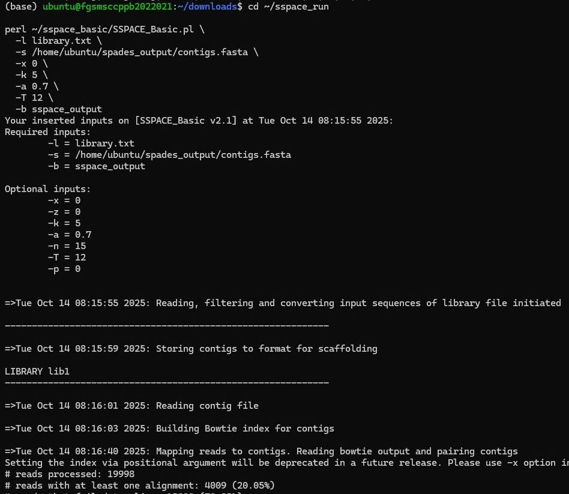

# Genome Assembly

## Overview

This section describes the genome assembly workflow used to reconstruct the genome of *Perenniporia cf. tephropora* DD18 from Illumina paired-end sequencing data. The workflow consisted of _de novo_ genome assembly using SPAdes, followed by scaffolding with SSPACE to improve assembly continuity. The scaffold assembly was subsequently filtered using SeqKit to remove scaffolds shorter than 1000 bp and polished using Pilon to improve assembly accuracy, resulting in a high-quality draft genome assembly suitable for downstream analyses.

---

## Rationale

_De novo_ genome assembly was performed to reconstruct the fungal genome from Illumina paired-end sequencing reads and generate a high-quality genome suitable for downstream analyses. The workflow combined multiple tools to progressively improve assembly quality. SPAdes was used to generate the initial contigs, SSPACE extended contigs into longer scaffolds using paired-end read information, SeqKit removed short scaffold fragments (<1000 bp) to reduce fragmentation and improve assembly quality, and Pilon polished the filtered assembly by correcting sequencing and assembly errors using aligned Illumina reads. This stepwise approach produced a more accurate and contiguous genome assembly for subsequent genome annotation and comparative genomic analyses.

---

## Bioinformatics Workflow

```
Raw Illumina Paired-End Reads
            │
            ▼
          SPAdes
     (De novo assembly)
            │
            ▼
         Contigs
            │
            ▼
          SSPACE
      (Scaffolding)
            │
            ▼
     Scaffold Assembly
            │
            ▼
          SeqKit
(Filter scaffolds ≥1000 bp)
            │
            ▼
          Pilon
(Assembly polishing)
            │
            ▼
Final Draft Genome Assembly
```
---
## Methodology

The genome assembly workflow consisted of four sequential stages to generate a high-quality fungal genome assembly. First, Illumina paired-end sequencing reads were assembled de novo into contigs using SPAdes. The resulting contigs were then scaffolded with SSPACE by utilizing paired-end read information to improve assembly continuity. Short scaffolds (<1000 bp) were subsequently removed using SeqKit to reduce fragmented and low-confidence sequences. Finally, the filtered assembly was polished with Pilon using aligned Illumina reads to correct base substitutions, insertions, deletions, and local assembly errors. Finally the most suitable genome assembly was selected for downstream genome annotation and comparative genomic analyses based on the combined results of the genome assembly quality assessment tools.

---

### Step 1. De novo Genome Assembly using SPAdes

#### Purpose

SPAdes was used to assemble quality-assessed Illumina paired-end sequencing reads into contiguous genome sequences (contigs).

#### Input Data

- Forward paired-end reads (`DD18_trim_1.fastq.gz`)
- Reverse paired-end reads (`DD18_trim_2.fastq.gz`)

#### Software

- SPAdes v3.15.5

#### Representative Command

```bash
spades.py \
-1 DD18_trim_1.fastq.gz \
-2 DD18_trim_2.fastq.gz \
-t 4 \
-m 16 \
-o spades_output
```

#### Representative Image

The following screenshot shows the successful execution of SPAdes during de novo genome assembly.


#### Output

- `contigs.fasta`

---

### Step 2. Genome Scaffolding using SSPACE

#### Purpose

SSPACE Basic v2.1 was used to improve genome assembly continuity by linking contigs into scaffolds using paired-end sequencing information.

#### Input

- `contigs.fasta`
- `library.txt

#### Software

- SSPACE Basic v2.1
- Bowtie v1.3.1
- Bash

#### The genome scaffolding process was performed using the following workflow:

- Validate paired-end FASTQ files to ensure sequencing quality.
- Split large FASTQ files into smaller paired chunks for efficient processing.
- Automatically generate the `library.txt` file required by SSPACE.
- Map paired-end reads to the assembled contigs using Bowtie.
- Scaffold contigs using SSPACE to improve genome assembly continuity.

#### Representative Command

```bash
perl SSPACE_Basic.pl \
-l library.txt \
-s contigs.fasta \
-x 0 \
-k 5 \
-a 0.7 \
-T 12 \
-b sspace_output
```

#### Representative Image

The following screenshot shows the successful execution of SSPACE Basic v2.1, including Bowtie indexing, paired-end read mapping, and scaffold construction.

`

#### Output

- `sspace_output.final.scaffolds.fasta`

---

### Step 3. Filter Short Scaffolds using SeqKit

#### Purpose

SeqKit was used to filter the scaffold assembly by removing scaffold sequences shorter than **1000 bp**. This filtering step reduced assembly fragmentation and retained longer scaffold sequences for downstream genome polishing and annotation.

#### Input

- `sspace_output.final.scaffolds.fasta`

#### Software

- SeqKit 2.10.1

#### Representative Command

```bash
seqkit seq -m 1000 \
~/sspace_run/sspace_output.final.scaffolds.fasta \
-o ~/sspace_run/sspace_output.filtered_1000.fasta
```

#### Representative Image

The following screenshot shows the successful execution of SeqKit filtering and verification of the filtered scaffold assembly statistics.


### Output

- `sspace_output.filtered_1000.fasta`

---

### Step 4. Genome Polishing using Pilon

#### Purpose

Pilon was used to polish the filtered scaffold assembly by correcting sequencing and assembly errors using Illumina paired-end reads mapped back to the genome assembly.

#### Input

- sspace_output.filtered_1000.fasta`
- Sorted BAM alignment file

#### Software

- Pilon 1.24

#### Representative Command

```bash
java -jar pilon.jar \
--genome sspace_output.filtered_1000.fasta \
--frags aligned_reads.sorted.bam \
--output pilon_output
--threads 8
--vcf
```

#### Representative Screenshot

The following screenshot shows the successful execution of Pilon during genome assembly polishing.


### Output

- Polished genome assembly

---

# Key Outcomes

- Successful _de novo_ genome assembly using SPAdes.
- Improved assembly continuity through SSPACE scaffolding.
- Removal of scaffold sequences shorter than 1000 bp using SeqKit.
- Improved assembly accuracy through genome polishing with Pilon.
- Generation of a high-quality draft genome assembly suitable for downstream quality assessment, genome annotation, phylogenetic analysis, and comparative genomics.

---

# References

Bankevich, A., et al. (2012). **SPAdes: A New Genome Assembly Algorithm and Its Applications to Single-Cell Sequencing.** *Journal of Computational Biology*, 19(5), 455–477.

Boetzer, M., Henkel, C.V., Jansen, H.J., Butler, D., & Pirovano, W. (2011). **Scaffolding pre-assembled contigs using SSPACE.** *Bioinformatics*, 27(4), 578–579.

Shen, W., Le, S., Li, Y., & Hu, F. (2016). **SeqKit: A cross-platform and ultrafast toolkit for FASTA/Q file manipulation.** *PLOS ONE*, 11(10), e0163962.

Walker, B.J., et al. (2014). **Pilon: An integrated tool for comprehensive microbial variant detection and genome assembly improvement.** *PLOS ONE*, 9(11), e112963.
