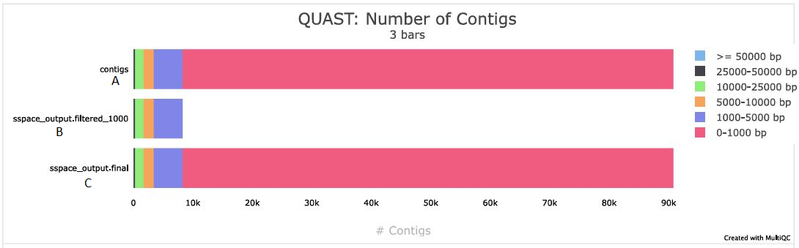

# Genome Assembly Assessment

## Overview

Evaluate the quality, completeness, and reliability of the assembled fungal genome before genome annotation and downstream comparative analyses.

---

## Rationale

Following genome assembly, the quality of the assembled genome must be evaluated to determine whether it is suitable for downstream analyses. In this study, four different genome assemblies generated during the assembly workflow were assessed and compared to identify the most reliable assembly.

Multiple complementary assessment tools were used to evaluate different aspects of assembly quality, including contiguity, completeness, read support, and sequencing depth.

The assessment results were compared across all four genome assemblies to identify the most complete, contiguous, and accurate assembly for downstream analyses, including genome annotation, gene prediction, and laccase gene characterization etc.

---

## Bioinformatics Workflow

```
    Assembled genome
            │
            ▼
        QUAST
 (Assembly Statistics)
            │
            ▼
        BUSCO
 (Genome Completeness)
            │
            ▼
        BBMap
(Read Mapping Assessment)
            │
            ▼
      Mosdepth
 (Coverage Analysis)
            │
            ▼
       MultiQC
(Integrated Quality Report)
```

---

## Assessment Tools

### QUAST

#### Purpose
QUAST was used to evaluate assembly contiguity and fragmentation using metrics such as N50, L50, total assembly size, GC content, and number of contigs.

#### Software
- QUAST 5.3.0

#### Methodology
QUAST was used to assess four genome assemblies generated during the assembly workflow. The resulting metrics were compared to identify the assembly with the best structural quality.

#### Representative command
```bash
quast.py \
~/spades.fasta \
~/sspace.fasta \
~/sspace1000.fasta \
~/pilon.fasta \
-o ~/quast_comparison
```
#### Representative Screenshot

The screenshot below shows the execution of the QUAST command used to compare four genome assemblies and generate assembly quality statistics.


#### Results
| Metric | SPAdes | SSPACE | Filtered (>1000 bp) | Pilon |
|:-------|-------:|--------:|--------------------:|------:|
| Genome size (Mb) | 60.41 | 60.41 | 55.59 | 55.59 |
| Total contigs | 15,627 | 15,627 | 8,289 | 8,289 |
| Largest contig (bp) | 133,223 | 133,223 | 133,223 | 133,223 |
| GC (%) | 54.88 | 54.88 | 54.85 | 54.85 |
| N50 (bp) | 10,705 | 10,705 | **11,930** | 11,927 |
| L50 | 1,540 | 1,540 | **1,326** | 1,326 |

#### Interpretation
Comparison of the four genome assemblies showed that the initial SPAdes and SSPACE assemblies produced similar assembly statistics. Filtering scaffolds shorter than 1000 bp substantially reduced assembly fragmentation and improved continuity, as indicated by an increased N50 (10,705 to 11,930 bp) and a decreased L50 (1,540 to 1,326), while maintaining a stable GC content. These results indicate that scaffold filtering improved assembly quality without altering the overall genome composition.

---
### MultiQC
MultiQC was used to summarize and visualize the QUAST results across the different genome assembly versions, enabling direct comparison of assembly contig-size distributions.

#### Software
- MultiQC 1.31

#### Representative Screenshot

Figure 1 MultiQC visualization of QUAST contig size distribution across three genome assemblies. (A) SPAdes assembly, (B) SSPACE assembly after filtering scaffolds shorter than 1000 bp, and (C) SSPACE scaffolded assembly before filtering. The figure illustrates the reduction in short contigs following filtering while preserving longer contigs.



---

### BUSCO

#### Purpose
BUSCO (Benchmarking Universal Single-Copy Orthologs) was used to assess genome assembly completeness by searching for highly conserved single-copy orthologs from the Basidiomycota lineage dataset, providing a standardized measure of the completeness of the assembled gene space.

#### Software
- BUSCO 6.0.0 / 5.4.4

#### Methodology
BUSCO was used to evaluate the completeness of each assembled genome (SPAdes, SSPACE, SSPACE (>1000 bp),	Pilon-polished) using the Basidiomycota lineage dataset (`basidiomycota_odb10`). BUSCO searched the assembly for highly conserved single-copy orthologous genes and classified them as Complete (single-copy or duplicated), Fragmented, or Missing. The resulting completeness metrics were used to assess the quality of the assembled gene space and determine its suitability for downstream genome annotation.

#### Representative command
```bash
busco \
-i filtered_1000.fasta \
-l basidiomycota_odb10 \
-o busco_filtered_1000 \
-m genome \
--cpu 12
```
#### Representative Screenshot
Figure 2 The BUSCO v6.0.0 command used to assess genome assembly completeness using the Basidiomycota lineage dataset.


#### Results

#### BUSCO Completeness Comparison
| BUSCO Metric | SPAdes<br>(BUSCO 5.4.4) | SSPACE<br>(BUSCO 6.0.0) | Filtered (>1000 bp)<br>(BUSCO 6.0.0) | Pilon<br>(BUSCO 6.0.0) |
|:------------|:-----------------------:|:-----------------------:|:------------------------------------:|:----------------------:|
| Complete BUSCOs (C) | 603 (79.5%) | 1452 (82.3%) | 1437 (81.5%) | 603 (79.6%) |
| Complete and single-copy BUSCOs (S) | 376 (49.6%) | 878 (49.8%) | 874 (49.5%) | 349 (46.0%) |
| Complete and duplicated BUSCOs (D) | 227 (29.9%) | 574 (32.5%) | 563 (31.9%) | 254 (33.5%) |
| Fragmented BUSCOs (F) | 94 (12.4%) | 218 (12.4%) | 190 (10.8%) | 96 (12.7%) |
| Missing BUSCOs (M) | 61 (8.1%) | 94 (5.3%) | 137 (7.8%) | 59 (7.8%) |
| Total BUSCO groups searched (n) | 758 | 1764 | 1764 | 758 |
| Genes with internal stop codons (%) | – | 10.9% | 11.0% | 12.4% |
| Internal stop codons (count) | – | 158 | 158 | 75 |

#### Interpretation
The filtered genome assembly achieved 81.5% complete BUSCOs, including 49.5% single-copy and 31.9% duplicated orthologs. Only 10.8% of BUSCO genes were fragmented, while 7.8% were missing, indicating good representation of the conserved fungal gene space. Approximately 11.0% of complete BUSCOs contained internal stop codons, suggesting that a small proportion of predicted genes may require further refinement.

#### Conclusion
BUSCO analysis demonstrated that the filtered assembly contained the majority of conserved Basidiomycota genes with relatively low fragmentation, supporting its suitability for downstream genome annotation and functional analyses.

---

### BBMap

#### Purpose
BBMap was used to evaluate sequencing read support for the SPAdes-assembled genome by mapping cleaned paired-end Illumina reads back to the assembly. Read mapping statistics were used to assess assembly accuracy, mapping efficiency, pairing consistency, and sequencing support for the assembled genome.

#### Software
- BBMap 39.06

#### Methodology
BBMap was used to align cleaned paired-end reads to the SPAdes-assembled genome. Mapping statistics, including mapping rate, properly paired reads, insert size distribution, substitution, insertion, and deletion rates, were evaluated to determine the quality and reliability of the assembled genome.

#### Representative command
```
bash
bbmap.sh
ref=/home/ubuntu/contigs.fasta \
in1=/home/ubuntu/DD18_trim_1.fastq \
in2=/home/ubuntu/DD18_trim_2.fastq \
out=/home/ubuntu/mapped.sam \
covstats=/home/ubuntu/covstats.txt \
threads=16
```
#### Results

The key BBMap alignment statistics are summarized below.
| Metric | Value |
|--------|------:|
| Total reads | 25,346,186 |
| Mapped reads | 25,300,412 |
| Mapping rate | **99.82%** |
| Properly paired reads | **84.04%** |
| Average coverage | **50.11×** |
| Reference bases covered | **94.84%** |

#### Interpretation
The BBMap alignment results demonstrated excellent agreement between the paired-end Illumina sequencing reads and the assembled genome. As summarized in the table and supported by the detailed alignment report, **99.82%** of reads successfully mapped to the assembly, **84.04%** were properly paired, and the average sequencing depth was **50.11×**. Furthermore, **94.84%** of the reference genome was covered by mapped reads, indicating that the assembly is well supported by the sequencing data and is suitable for downstream analyses, including genome annotation, repeat analysis, and gene characterization.

#### Conclusion
BBMap confirmed that the assembled genome is highly consistent with the original sequencing reads. The high mapping rate, substantial genome coverage, and adequate sequencing depth indicate that the assembly is accurate and reliable for downstream bioinformatics analyses.

---

### Mosdepth

#### Purpose
Mosdepth was used to calculate sequencing depth and genome coverage by analyzing the alignment of Illumina paired-end reads to the SPAdes-assembled genome. Coverage statistics were used to evaluate whether the genome assembly had sufficient and uniform sequencing support for downstream analyses.

#### Methodology
The BBMap alignment file (mapped.sam) was converted to a sorted and indexed BAM file using Samtools. The sorted BAM file was then analyzed with Mosdepth to calculate genome-wide sequencing depth and coverage statistics. The resulting coverage profiles were used to assess average sequencing depth, genome coverage, and the distribution of read coverage across the SPAdes-assembled genome.

#### Representative command
```
bash
mosdepth -t 4 mapped mapped.sorted.bam
```
#### Representative Screenshot
Figure 3 The workflow used to prepare the sorted BAM file and execute Mosdepth for genome-wide sequencing depth analysis.


### Results

#### Visualization of Mean Coverage per Contig

#### Purpose
To visualize the distribution of mean sequencing depth across assembled contigs using Mosdepth summary statistics and identify variation in sequencing coverage across the genome.

#### Python Script
```
import pandas as pd
import matplotlib.pyplot as plt

df = pd.read_csv(
    "/home/ubuntu/mosdepth_results/mapped.mosdepth.summary.txt",
    sep="\t"
)

plt.figure(figsize=(10,6))
plt.bar(df["chrom"], df["mean"])
plt.xticks([], [])  # hide contig names (too many)
plt.ylabel("Mean Coverage (X)")
plt.title("Coverage per Contig (mosdepth summary)")

plt.savefig(
    "/home/ubuntu/mosdepth_results/coverage_plot.png",
    dpi=300,
    bbox_inches="tight"
)

print("Plot saved to ~/mosdepth_results/coverage_plot.png")
```

#### Coverage per Contig (Overall)


**Figure 4.** Genome-wide mean sequencing coverage across all assembled contigs generated using Mosdepth. The plot shows the overall distribution of coverage, including a small number of high-coverage contigs.

---

#### Coverage per Contig (Zoomed View)


**Figure 5.** Zoomed view of the coverage distribution (capped at 100×) highlighting the coverage pattern across the majority of assembled contigs. This view improves visualization by minimizing the influence of extreme high-coverage contigs.

#### Interpretation
The overall coverage plot indicates that most contigs were covered at moderate sequencing depths, while a small number of contigs exhibited substantially higher coverage. The zoomed view shows that the majority of contigs were covered within the expected range, consistent with the average sequencing depth of approximately 50×. These results indicate that sequencing coverage was generally sufficient and well distributed across the assembled genome, supporting the reliability of the assembly for downstream analyses.

#### GC Content vs. Sequencing Coverage per Contig

#### Purpose

To examine the relationship between GC content and mean sequencing depth across assembled contigs and assess potential GC-related variation in sequencing coverage.

#### Python Script
1. Prepare GC and coverage data
```
from Bio import SeqIO
import pandas as pd

fasta = "/home/ubuntu/spades_output/contigs.fasta"
coverage_file = "/home/ubuntu/mosdepth_results/mapped.mosdepth.summary.txt"

df_cov = pd.read_csv(coverage_file, sep="\t")

gc_data = []

for record in SeqIO.parse(fasta, "fasta"):
    seq = str(record.seq).upper()
    gc_count = seq.count("G") + seq.count("C")
    gc_percent = (gc_count / len(seq)) * 100 if len(seq) > 0 else 0
    gc_data.append([record.id, len(seq), gc_percent])

df_gc = pd.DataFrame(gc_data, columns=["chrom", "length", "GC%"])

df = pd.merge(df_gc, df_cov, on="chrom")

output_file = "/home/ubuntu/mosdepth_results/contig_gc_cov.tsv"
df.to_csv(output_file, sep="\t", index=False)

print(f"Saved contig GC% + coverage to: {output_file}")
```

2. Generate GC% vs. coverage plot
```
import pandas as pd
import matplotlib.pyplot as plt

df = pd.read_csv(
    "/home/ubuntu/mosdepth_results/contig_gc_cov.tsv",
    sep="\t"
)

plt.figure(figsize=(8,6))
plt.scatter(df["GC%"], df["mean"], s=10, alpha=0.6, color="teal")

plt.xlabel("GC%")
plt.ylabel("Mean Coverage (X)")
plt.title("GC% vs Coverage per Contig")

plt.savefig(
    "/home/ubuntu/mosdepth_results/gc_vs_coverage.png",
    dpi=300,
    bbox_inches="tight"
)

plt.show()
```

#### GC Content vs Coverage

**Figure 6.** The figure below illustrates the relationship between GC content and mean sequencing coverage for assembled contigs. Each point represents an individual contig.


#### Interpretation
No strong relationship was observed between GC content and sequencing depth. Most contigs clustered around 52–60% GC, with moderate sequencing coverage, indicating minimal GC-related sequencing bias. A few contigs showed unusually high coverage regardless of GC content, suggesting that these regions may represent repetitive elements or highly abundant sequences rather than GC-dependent coverage variation.

#### Conclusion

Mosdepth analysis demonstrated that the assembled genome was supported by high sequencing depth and broad read coverage. The average genome coverage (~50×) and extensive coverage across the reference genome indicate that the assembly is well supported by the sequencing data. Together with the BBMap mapping results, these findings provide strong evidence that the assembly is reliable and suitable for downstream analyses. The high sequencing depth and broad reference coverage indicate that the assembled genome was well supported by the sequencing reads. Together with the BBMap mapping results, the Mosdepth analysis supports the reliability of the assembly for downstream genome annotation, repeat identification, and gene characterization.

## Overall Assembly Assessment and Selection

The genome assemblies were evaluated using complementary quality assessment approaches. QUAST was used to compare assembly continuity and basic assembly statistics, while BUSCO assessed gene-space completeness. BBMap and Mosdepth were used to evaluate read-mapping support and sequencing coverage using the SPAdes-assembled genome.

Based on the combined assessment of assembly continuity, completeness, read support, and sequencing coverage, the **SSPACE assembly with scaffolds shorter than 1000 bp fltered genome was selected as the final assembly for downstream genome annotation**. Filtering reduced assembly fragmentation while retaining the major genomic sequence content, making the filtered SSPACE assembly more suitable for subsequent structural and functional annotation.

---

## References

Gurevich, A., Saveliev, V., Vyahhi, N., & Tesler, G. (2013). QUAST: Quality Assessment Tool for Genome Assemblies. *Bioinformatics*, 29(8), 1072–1075.

Manni, M., Berkeley, M. R., Seppey, M., Simão, F. A., & Zdobnov, E. M. (2021). BUSCO Update: Novel and Streamlined Workflows Along with Broader and Deeper Phylogenetic Coverage for Scoring of Eukaryotic, Prokaryotic, and Viral Genomes. *Molecular Biology and Evolution*, 38(10), 4647–4654.

Bushnell, B. BBMap: A Fast and Accurate Short Read Aligner. Lawrence Berkeley National Laboratory.

Pedersen, B. S., & Quinlan, A. R. (2018). Mosdepth: Quick Coverage Calculation for Genomes and Exomes. *Bioinformatics*, 34(5), 867–868.

Ewels, P., Magnusson, M., Lundin, S., & Käller, M. (2016). MultiQC: Summarize Analysis Results for Multiple Tools and Samples in a Single Report. *Bioinformatics*, 32(19), 3047–3048.
