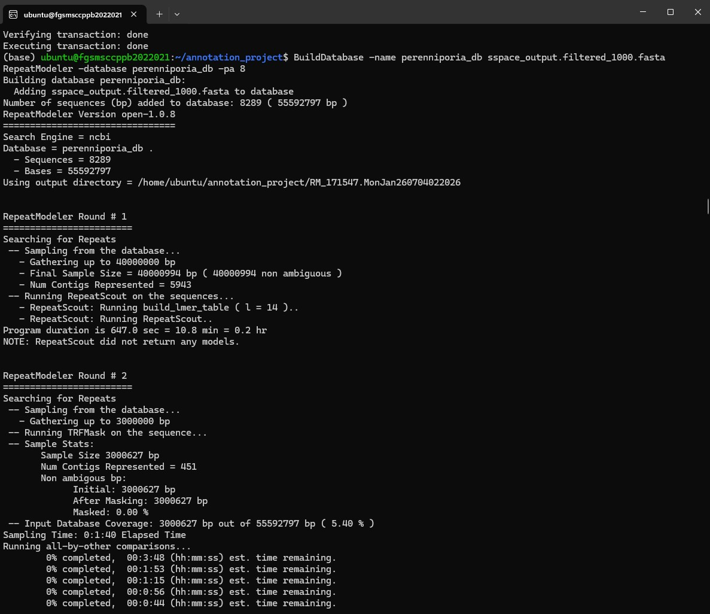
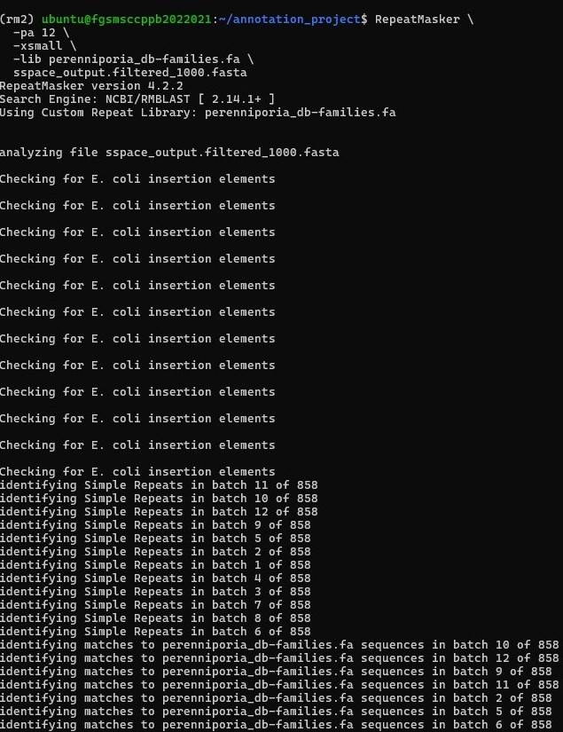

# Repeat Masking and Soft Masking

## Repeat Identification Using RepeatModeler

### Overview
RepeatModeler is a de novo repeat discovery tool used to identify repetitive DNA sequences within a genome assembly. It automatically detects repeat families without relying on existing repeat databases and generates a species-specific repeat library. This repeat library is subsequently used by RepeatMasker to identify and soft-mask repetitive regions before structural genome annotation.

### Rationale
Repetitive DNA sequences can interfere with accurate gene prediction by producing false or fragmented gene models. Therefore, repetitive elements should be identified before structural annotation. RepeatModeler performs de novo repeat discovery by analyzing the assembled genome and constructing a species-specific repeat library. This custom repeat library improves repeat detection accuracy, particularly for organisms whose repetitive elements are poorly represented in public databases.

### Workflow
```
Assembled Genome
        │
        ▼
Build Genome Database
        │
        ▼
RepeatModeler
        │
        ▼
De novo Repeat Discovery
        │
        ▼
Species-specific Repeat Library
        │
        ▼
RepeatMasker
```

### Methodology

#### Software
RepeatModeler 2.0.7
RepeatMasker 4.2.2

#### Step 1 – Build the Genome Database
The assembled genome was converted into a searchable database using the BuildDatabase utility provided with RepeatModeler.

##### Representative Commands
```
BuildDatabase \
-name perenniporia_db \
sspace_output.filtered_1000.fasta
```

#### Step 2 – Perform De Novo Repeat Discovery
RepeatModeler iteratively analyzed the genome database to identify repetitive sequence families using its integrated repeat discovery algorithms.

##### Representative Commands
```
RepeatModeler \ 
-database perenniporia_db \
-threads 12 \ 
-LTRStruct
```
#### Representative Screenshot 

Figure 1. Creation of the RepeatModeler genome database and initiation of de novo repeat family discovery with LTR structural analysis using the filtered Perenniporia cf. tephropora DD18 genome assembly.



##### Interpretation
The filtered genome assembly was first converted into a RepeatModeler database to prepare the genome for repeat analysis. RepeatModeler was then executed with LTR structural analysis enabled to identify repetitive DNA sequences and generate a species-specific repeat library. This custom repeat library was subsequently used by RepeatMasker to identify and soft-mask repetitive regions prior to structural genome annotation.

| Output                     |                        Result |
| -------------------------- | ----------------------------: |
| Custom repeat library      | `perenniporia_db-families.fa` |
| Repeat families identified |                           122 |

RepeatModeler successfully generated a custom repeat library (perenniporia_db-families.fa) containing 122 repeat family sequences, which was subsequently used by RepeatMasker for genome soft masking.

#### Step 3 – Generate a Species-specific Repeat Library
The identified repeat families were combined into a custom repeat library, which was used as the reference library for RepeatMasker to perform repeat masking and soft masking.

##### Representative Commands
```
RepeatMasker \
-pa 12 \ 
-xsmall \
-lib perenniporia_db-families.fa \
sspace_output.filtered_1000.fasta
```
#### Representative Screenshot 

Figure 2. Execution of RepeatMasker using the custom repeat library generated by RepeatModeler to identify and soft-mask repetitive DNA sequences in the filtered Perenniporia cf. tephropora DD18 genome assembly.



Interpretation

RepeatMasker was executed using the species-specific repeat library (perenniporia_db-families.fa) generated by RepeatModeler. The program scanned the filtered genome assembly for repetitive DNA sequences by comparing the genome against the custom repeat library and initiated the soft-masking process. The resulting soft-masked genome assembly was subsequently used for structural genome annotation to reduce the influence of repetitive elements on gene prediction.

### RepeatMasker Results
| Metric                     | Result                        |
| -------------------------- | ----------------------------- |
| Custom repeat library      | `perenniporia_db-families.fa` |
| Repeat families identified | 122                           |
| Unknown repeat families    | 103                           |
| Bases soft-masked          | 3,132,583 bp                  |
| Genome masked              | 5.63%                         |
| Output files               | `.mask`, `.out`, `.tbl`       |

RepeatMasker successfully soft-masked 3,132,583 bp (5.63%) of the filtered genome assembly using the custom repeat library generated by RepeatModeler. The process produced a masked genome sequence (.mask) together with detailed annotation (.out) and summary (.tbl) files for downstream genome annotation.

