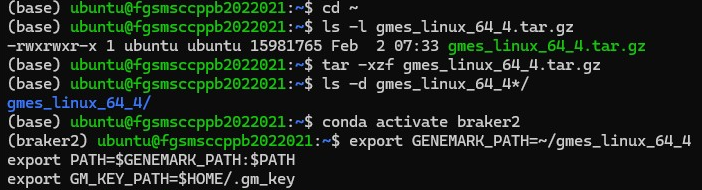
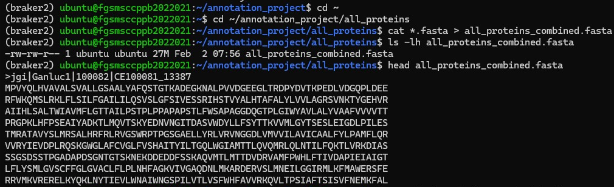
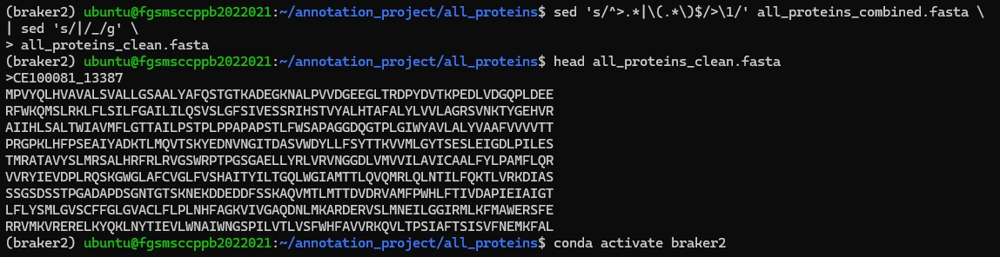
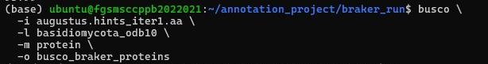

# Structural Genome Annotation

## Overview
Structural genome annotation identifies protein-coding genes within the assembled genome by integrating genomic sequences with external protein evidence. In this workflow, the soft-masked fungal genome was annotated using BRAKER2 with homologous protein evidence from related fungal species. The quality of the predicted proteins was subsequently assessed using BUSCO before downstream functional annotation and laccase gene identification.

## Rationale
Accurate structural annotation is essential for identifying genes and predicting their biological functions. BRAKER2 combines ab initio gene prediction with external protein evidence, resulting in more reliable gene models than ab initio prediction alone. Evaluating the predicted proteins using BUSCO provides an independent assessment of annotation completeness before functional annotation and candidate gene analysis.

## Workflow
```
Soft-masked Genome
        │
        ▼
Prepare Protein Evidence
        │
        ▼
Configure BRAKER2
        │
        ▼
Run BRAKER2
        │
        ▼
Predicted Gene Models
        │
        ▼
BUSCO Assessment
        │
        ▼
High-quality Annotated Proteins
```

## Step 1 – Configure BRAKER2 Environment
### Methodology
Before annotation, the GeneMark-ES package was configured within the BRAKER2 environment by extracting the software, defining the required environment variables, and verifying the GeneMark license file. This ensured that all dependencies required by BRAKER2 were available before running structural annotation.

#### Representative command
```
export GENEMARK_PATH=~/gmes_linux_64_4
export PATH=$GENEMARK_PATH:$PATH
export GM_KEY_PATH=$HOME/.gm_key
```
#### Representative Screenshot

Figure 1. Configuration of the GeneMark-ES environment required for BRAKER2 structural genome annotation.



#### Interpretation

The GeneMark software was successfully configured by defining the executable path and license file, enabling BRAKER2 to access GeneMark during gene prediction.

## Step 2 – Prepare Protein Evidence
### Methodology
Protein sequences from several related fungal species were collected, combined into a single FASTA file, and cleaned to remove unnecessary header information. The resulting protein database served as external evidence for BRAKER2 gene prediction.

#### Representative commands
```
cat *.fasta > all_proteins_combined.fasta
```
#### Representative Screenshot

Figure 2. Combining protein evidence files from multiple fungal species into a single FASTA file for use as protein homology evidence during BRAKER2 structural genome annotation.



#### Representative commands
```
sed 's/^>.*|\(.*\)$/>\1/' all_proteins_combined.fasta \
| sed 's/|/_/g' \
> all_proteins_clean.fasta
```
#### Representative Screenshot

Figure 3. Standardizing FASTA headers of the combined protein evidence file by removing additional metadata to produce a clean protein FASTA compatible with BRAKER2.vv



#### Interpretation

Protein sequences from multiple related fungal species were combined into a single reference protein dataset to maximize the availability of homology evidence during structural genome annotation. The FASTA headers were subsequently standardized by removing unnecessary metadata, resulting in a clean protein evidence file compatible with BRAKER2. This curated protein dataset was then used as external evidence to improve the accuracy of gene prediction in the assembled Perenniporia cf. tephropora DD18 genome.

## Step 3 – Structural Annotation Using BRAKER2
### Methodology
BRAKER2 was executed using the soft-masked genome assembly together with the cleaned protein evidence database. Protein homology information was incorporated during gene prediction to generate high-confidence structural annotations.

#### Representative command
```
braker.pl \
--genome=sspace_output.filtered_1000.fasta.masked \
--prot_seq=all_proteins_clean.fasta \
--softmasking \
--species=Perenniporia \
--cores=12 \
--workingdir=braker_run
```
#### Representative Screenshot

Figure 4. Structural genome annotation using BRAKER2 with a soft-masked genome assembly and homologous protein evidence.


#### Interpretation

BRAKER2 successfully integrated protein homology information with the soft-masked genome to predict protein-coding genes. The annotation pipeline completed successfully and generated annotated gene models for downstream analyses.

## Step 4 – Assess Structural Annotation Using BUSCO
### Methodology
The completeness of the predicted protein set was evaluated using BUSCO against the Basidiomycota reference dataset. BUSCO classified orthologous genes as complete, duplicated, fragmented, or missing.

#### Representative command
```
busco \
-i augustus.hints_iter1.aa \
-l basidiomycota_odb10 \
-m proteins \
-o busco_braker_proteins
```
#### Representative Screenshot

Figure 5. BUSCO assessment of the predicted protein set generated by BRAKER2 using the Basidiomycota reference lineage.



#### Interpretation

BUSCO analysis demonstrated that most conserved fungal orthologs were successfully recovered, indicating that the BRAKER2 annotation generated a biologically representative protein set suitable for downstream functional annotation and candidate gene identification.
