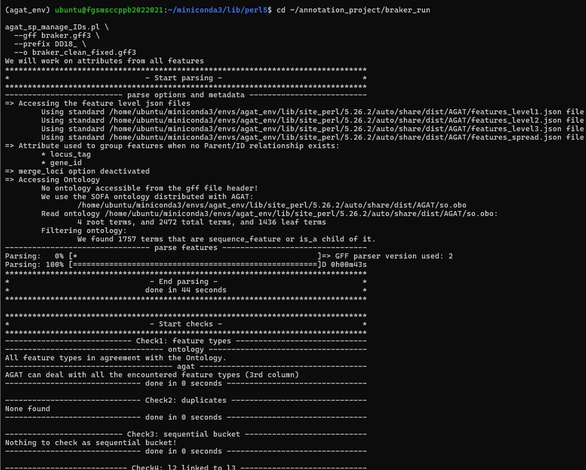
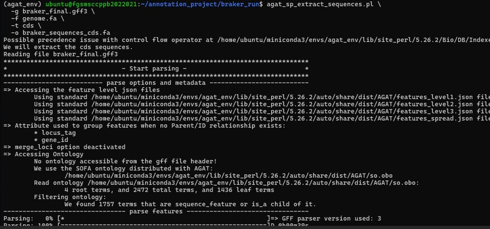
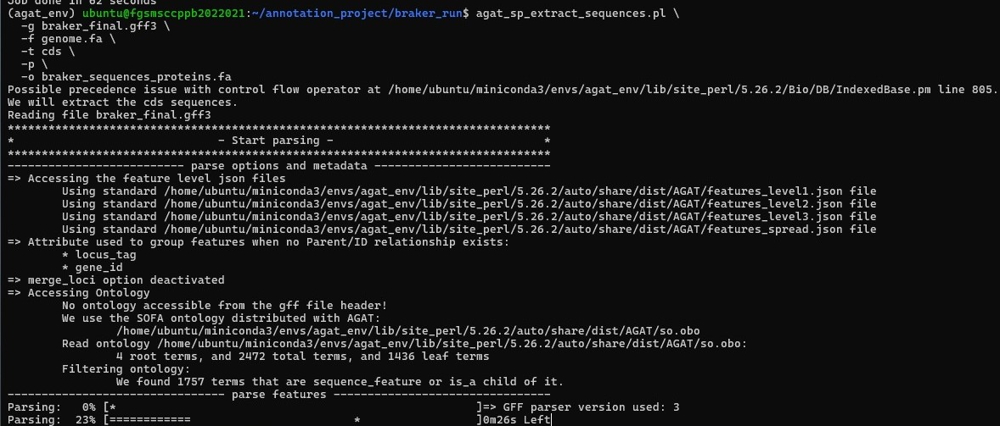
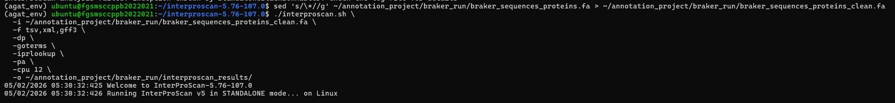

# Functional Genome Annotation

## Overview
This repository documents the functional genome annotation workflow performed after structural genome annotation of Perenniporia cf. tephropora DD18. The BRAKER2 annotation was standardized using AGAT to generate consistent gene identifiers and extract coding and protein sequences. The predicted proteins were subsequently annotated using InterProScan to identify conserved protein domains, protein families, Gene Ontology (GO) terms, and biological pathways, enabling comprehensive functional characterization of the predicted proteome.

## Rationale
Functional annotation links predicted genes to known biological functions by identifying conserved protein domains, families, and Gene Ontology terms. Standardizing the structural annotation before functional analysis ensures consistent feature identifiers and improves compatibility with downstream bioinformatics analyses.

## Workflow
```
BRAKER2 Annotation
        │
        ▼
AGAT Standardization
        │
        ▼
Extract CDS & Protein Sequences
        │
        ▼
Clean Protein FASTA
        │
        ▼
InterProScan
        │
        ▼
Protein Domains
GO Terms
Protein Families
Pathways
```

## Step 1. Standardize BRAKER2 Annotation

### Purpose
Standardize the BRAKER2 GFF3 annotation by assigning consistent gene identifiers and validating the annotation structure for downstream analyses.

#### Representative Commands
```
agat_sp_manage_IDs.pl \
  --gff braker.gff3 \
  --prefix DD18_ \
  -o braker_clean_fixed.gff3
```
#### Representative Screenshot

Figure 1- Execution of AGAT for standardizing the BRAKER2 GFF3 annotation and validating annotation integrity prior to downstream functional annotation.



#### Interpretation
The BRAKER2 annotation was successfully processed using AGAT to generate a standardized GFF3 file with consistent gene identifiers. During execution, AGAT parsed the annotation, validated feature types against the Sequence Ontology, confirmed that no duplicate features were present, and reported no structural inconsistencies. The standardized annotation was therefore suitable for subsequent sequence extraction and functional annotation with InterProScan.

## Step 2. Extract Coding and Protein Sequences

### Purpose
Generate coding sequence (CDS) and predicted protein FASTA files from the standardized annotation.

### Methodology
AGAT was used to extract CDS sequences and translate them into predicted protein sequences based on the final genome annotation.

#### Representative Commands
```
agat_sp_extract_sequences.pl \
-g braker_final.gff3 \
-f genome.fa \
-t cds \
-o braker_sequences_cds.fa
```

```
agat_sp_extract_sequences.pl \
-g braker_final.gff3 \
-f genome.fa \
-t cds \
-p \
-o braker_sequences_proteins.fa
```

#### Representative Screenshots

Figure 2 & 3 Extraction of **coding sequences** and **predicted protein sequences** from the standardized genome annotation using AGAT.





#### Interpretation
Coding sequences and corresponding protein sequences were successfully extracted from the standardized annotation, providing the datasets required for downstream functional annotation.

## Step 3. Functional Annotation Using InterProScan

### Purpose
Assign functional annotations to predicted proteins.

### Methodology
Protein sequences were cleaned by removing terminal stop codon symbols before being analyzed using InterProScan with multiple integrated protein signature databases.

#### Representative Command
```
./interproscan.sh \
-i braker_sequences_proteins_clean.fa \
-f tsv,xml,gff3 \
-dp \
-goterms \
-iprlookup \
-pa \
-cpu 12
```
#### Representative Screenshot

Figure 4 Execution of InterProScan for functional annotation of predicted protein sequences.



#### Interpretation
InterProScan successfully analyzed the predicted proteins and integrated multiple protein signature databases to assign conserved domains, protein families, Gene Ontology terms, and pathway annotations.

## Functional Annotation Outputs
InterProScan generated multiple output files containing functional annotations for the predicted protein sequences. These outputs provide information on conserved protein domains, functional classifications, Gene Ontology (GO) terms, pathway associations, and InterPro accession numbers, enabling comprehensive functional characterization of the predicted proteins.

| Output File                    | Description                                                                                                                                                            |
| ------------------------------ | ---------------------------------------------------------------------------------------------------------------------------------------------------------------------- |
| **interproscan.tsv**           | Primary annotation file containing protein matches against integrated databases, including domain information, GO terms, InterPro accessions, and pathway annotations. |
| **interproscan.gff3**          | Functional annotations in GFF3 format, suitable for genome browsers and integration with structural genome annotations.                                                |
| **interproscan.xml**           | XML-formatted annotation results for downstream analyses and data exchange.                                                                                            |
| **GO annotations**             | Gene Ontology terms describing Biological Process, Molecular Function, and Cellular Component for annotated proteins.                                                  |
| **InterPro accessions**        | Unique InterPro identifiers assigned to proteins based on conserved domains and protein signatures.                                                                    |
| **Pathway annotations**        | Reactome and MetaCyc pathway information for proteins associated with known biological pathways.                                                                       |
| **Protein domain annotations** | Conserved domains identified from integrated databases such as Pfam, SMART, CDD, Gene3D, SUPERFAMILY, PANTHER, PRINTS, PIRSF, PROSITE, HAMAP, NCBIfam, and others.     |

### Output Summary
The InterProScan analysis integrated multiple protein signature databases to assign functional annotations to the predicted proteins. The resulting annotations included conserved protein domains, InterPro classifications, Gene Ontology terms, and biological pathway information, providing a comprehensive functional characterization of the predicted proteome and supporting downstream analyses such as candidate gene identification and protein function prediction.

