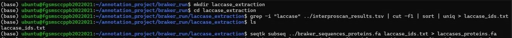
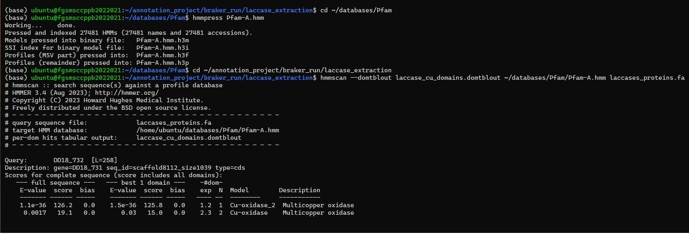
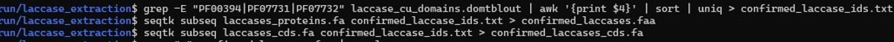
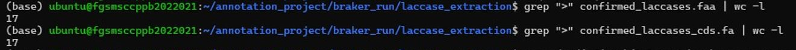

# Laccase Gene Identification

## Overview
This module describes the workflow used to identify putative laccase genes from the predicted protein set of Perenniporia cf. tephropora DD18. Candidate proteins were first retrieved using functional annotations generated by InterProScan. Conserved multicopper oxidase domains were then identified using the Pfam database and HMMER. Candidate proteins containing the characteristic laccase copper-oxidase domains were retained, followed by extraction of their protein and coding sequences and evaluation of protein completeness and domain architecture.

## Rationale
Laccases are multicopper oxidase enzymes involved in lignin degradation by white-rot fungi. Because genome annotation predicts many multicopper oxidase proteins, additional validation is required to identify true laccase genes. This workflow combines functional annotation, conserved domain analysis, sequence extraction, and protein validation to identify high-confidence laccase genes for downstream characterization.

## Workflow
```
InterProScan Annotation
          │
          ▼
Extraction of Candidate Laccase Proteins
          │
          ▼
Retrieve Coding Sequences
          │
          ▼
Identification of Conserved Copper Oxidase Domains
          │
          ▼
Confirm Laccase-specific Domains
          │
          ▼
Assess Protein Completeness
          │
          ▼
Evaluate Domain Architecture
          │
          ▼
Final Confirmed Laccase Genes
```
## Step 1. Extraction of Candidate Laccase Proteins

### Purpose
To identify proteins annotated as laccases from the InterProScan functional annotation results and extract their corresponding amino acid sequences for downstream domain analysis.

#### Representative command
```
grep -i "laccase" ../interproscan_results.tsv \
| cut -f1 \
| sort \
| uniq > laccase_ids.txt
```

```
seqtk subseq ../braker_sequences_proteins.fa \
laccase_ids.txt \
> laccases_proteins.fa
```

#### Representative Screenshot

Figure 1- Identification of candidate laccase proteins from InterProScan functional annotations and extraction of the corresponding protein sequences using Seqtk.



### Interpretation
Proteins annotated as laccases were identified from the InterProScan annotation results. The corresponding amino acid sequences were extracted from the predicted proteome for subsequent conserved domain analysis.

## Step 2. Retrieve Candidate Coding Sequences

### Purpose
To retrieve the coding DNA sequences (CDS) corresponding to the candidate laccase proteins for downstream gene characterization and sequence validation.

#### Representative command
```
seqtk subseq \
../braker_sequences_cds.fa \
laccase_ids.txt \
> laccases_cds.fa
```

### Interpretation
Coding sequences associated with the candidate laccase proteins were extracted from the predicted CDS dataset for downstream completeness assessment and gene characterization.

## Step 3. Identification of Conserved Copper Oxidase Domains

### Purpose
To identify conserved multicopper oxidase domains in the candidate laccase proteins using the Pfam database and HMMER, providing evidence for laccase-specific protein signatures.

#### Representative command
```
hmmpress Pfam-A.hmm
```
```
hmmscan \
--domtblout laccase_cu_domains.domtblout \
Pfam-A.hmm \
laccases_proteins.fa
```

#### Representative Screenshot

Figure 2. Preparation of the Pfam Hidden Markov Model database and identification of conserved copper oxidase domains in candidate laccase proteins using HMMER.



### Interpretation
Candidate proteins were scanned against the Pfam database to identify conserved multicopper oxidase domains (PF00394, PF07731, and PF07732), providing evidence for putative fungal laccase proteins.

## Step 4. Confirmation of Laccase-Specific Domains

### Purpose
To confirm candidate proteins containing the characteristic laccase copper oxidase domains and extract the corresponding protein and coding sequences for further validation.

### Representative Commands
#### Identify Confirmed Laccase Protein IDs
* Identifies proteins containing the conserved laccase-specific Pfam domains (PF00394, PF07731, and PF07732), extracts their unique protein IDs from the HMMER output, and saves them for downstream sequence extraction.
```
grep -E "PF00394|PF07731|PF07732" laccase_cu_domains.domtblout \
| awk '{print $4}' \
| sort | uniq > confirmed_laccase_ids.txt
```
#### Extract Confirmed Laccase Protein Sequences
* Extracts the confirmed laccase protein sequences using the validated protein IDs.
```
seqtk subseq \
laccases_proteins.fa \
confirmed_laccase_ids.txt \
> confirmed_laccases.faa
```
#### Extract Confirmed Laccase Coding Sequences (CDS)
* Extracts the coding sequences (CDS) corresponding to the confirmed laccase proteins.
```
seqtk subseq \
laccases_cds.fa \
confirmed_laccase_ids.txt \
> confirmed_laccases_cds.fa
```

#### Representative Screenshot

Figure 3. Command-lines  for identification of proteins containing conserved laccase-specific Pfam domains (PF00394, PF07731, and PF07732) from HMMER domain annotation results, followed by extraction of the corresponding protein and coding DNA sequences using Seqtk.



### Interpretation
Only proteins containing the characteristic laccase copper oxidase domains were retained. Protein and coding sequences of these confirmed candidates were extracted for further validation.

## Step 5. Assessment of Protein Completeness

### Purpose
To evaluate the completeness of the confirmed laccase genes by determining the number of protein and coding sequences, verifying complete open reading frames (ORFs), and calculating protein lengths.

### Representative Command
#### Count Confirmed Laccase Protein Sequences
* Counts the total number of confirmed laccase protein sequences.
```
grep ">" confirmed_laccases.faa | wc -l
```

#### Count Confirmed Laccase Coding Sequences
* Counts the total number of confirmed laccase coding sequences (CDS).
```
grep ">" confirmed_laccases_cds.fa | wc -l
```

#### Representative Screenshot

Figure 4. Command-line output showing the total number of confirmed laccase protein sequences and corresponding coding DNA sequences (CDS) identified after domain-based confirmation.



### Interpretation
The total numbers of confirmed laccase protein sequences and their corresponding coding DNA sequences (CDS) were determined. The equal sequence counts indicate that each confirmed laccase protein has a corresponding coding sequence, providing a consistent dataset for downstream sequence validation and characterization.

#### Assess Coding Sequence Completeness
* Checks whether each coding sequence begins with a valid start codon (ATG), ends with a valid stop codon (TAA, TAG, or TGA), and has a sequence length that is a multiple of three, indicating a complete open reading frame (ORF).
```
awk '/^>/{if(seq){l=length(seq); start=substr(seq,1,3); end=substr(seq,l-2,3);
if(start!="ATG" || (end!="TAA" && end!="TAG" && end!="TGA")) print header;}
seq=""; header=$0; next}{seq=seq $0}
END{l=length(seq); start=substr(seq,1,3); end=substr(seq,l-2,3);
if(start!="ATG" || (end!="TAA" && end!="TAG" && end!="TGA")) print header}' confirmed_laccases_cds.fa
```

#### Calculate Protein Lengths
* Calculates the amino acid length of each confirmed laccase protein to assess sequence completeness.
```
awk '/^>/{if(seq){print header,length(seq); seq=""}
header=$0; next}
{seq=seq $0}
END{print header,length(seq)}' confirmed_laccases.faa
```


